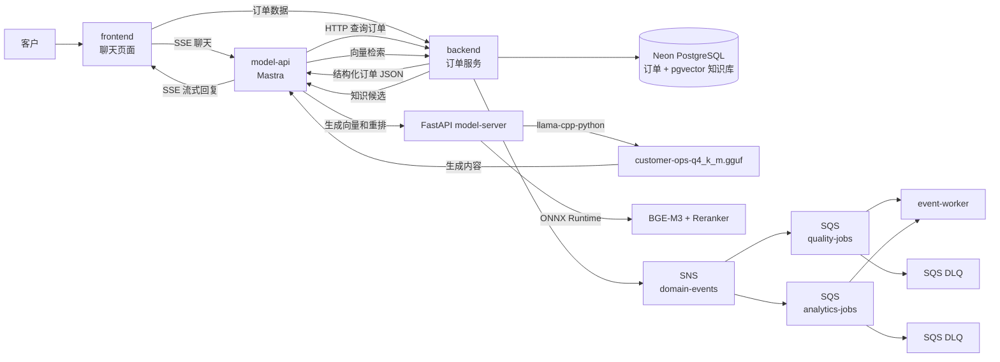

# 智能客服系统设计与实施文档

## 1. 项目目标

本项目实现一个可以查询实时订单信息的智能客服系统。

用户在前端聊天页面提交问题和订单号；前端调用 Mastra 服务；Mastra 并行查询实时订单数据和知识库，再将用户问题、订单数据、重排后的参考资料和客服规则交给 FastAPI 模型服务。FastAPI 同时加载自训练产物 `customer-ops-q4_k_m.gguf`、BGE-M3 ONNX 和 BGE Reranker ONNX，最后把模型回答流式返回前端。知识检索失败时降级为无参考资料回答，不中断客服聊天。

项目还必须完成三项 AWS 技术任务：

1. CloudWatch Synthetics 自动巡检。
2. SNS、SQS 和死信队列业务场景。
3. API Gateway REST API Canary 灰度发布与回滚。

## 2. MVP 范围

### 包含

- 客户聊天页面。
- 流式显示模型回复。
- Mastra 对话编排服务。
- 通过 FastAPI + `llama-cpp-python` 直接调用 GGUF 自训练模型。
- 通过后端 HTTP API 查询订单。
- 使用 pgvector、BGE-M3 和 BGE Reranker 完成知识检索与重排。
- 独立、幂等的 Markdown 知识摄取工具。
- 后端执行身份校验、订单归属校验和数据库查询。
- 保存必要的对话完成记录。
- 对话完成事件通过 SNS 分发到 SQS。
- SQS 消费失败后进入 DLQ，并支持 redrive。
- CloudWatch Synthetics 后端 API 健康巡检。
- API Gateway Canary 灰度发布、指标观察和回滚。
- 使用基础设施代码创建 AWS 资源。

### 暂不包含

- 完整客服工作台和人工接管系统。
- 多租户管理后台。
- MCP Server 和高风险写操作。
- 退款、取消订单、修改地址等实际业务操作。
- 多模型路由和云端备用模型。
- Monorepo、共享 packages、Rust crates 或统一 Workspace。

## 3. 项目目录

各部分是相互独立的应用，不使用 pnpm workspace、Turborepo 或 Cargo Workspace。

```text
customer-ops-platform/
├── apps/
│   ├── frontend/       # 客服聊天页面
│   ├── model-api/      # Mastra 编排、后端调用和模型调用
│   ├── model-server/   # FastAPI 直接加载 GGUF
│   ├── backend/        # 订单 API、鉴权和数据库访问
│   └── event-worker/   # SQS 消费者
├── knowledge/          # 客服知识 Markdown
├── tools/              # 离线知识摄取工具
├── infra/              # AWS CloudFormation 与部署脚本
├── docs/
│   ├── README.md
│   └── assets/
└── README.md
```

每个应用拥有自己的依赖、环境变量、测试和启动命令。应用之间只通过 HTTP API 或 AWS 消息进行通信。

## 4. 系统架构

### 本地端口

| 服务 | 地址 |
| ---- | ---- |
| Frontend | `http://127.0.0.1:3002` |
| Mastra model-api | `http://127.0.0.1:4111` |
| Python model-server | `http://127.0.0.1:8000` |
| Backend | `http://127.0.0.1:8080` |

每个服务使用独立端口。服务间地址必须通过对应应用的 `.env` 配置，不使用同一个
`PORT` 值覆盖多个进程。



### 服务职责

| 服务           | 职责                                                         | 不负责                           |
| -------------- | ------------------------------------------------------------ | -------------------------------- |
| `frontend`     | 调用 Mastra 聊天接口、调用 Backend 订单接口并展示数据         | 不直接访问数据库或 Python 模型服务 |
| `model-api`    | Mastra 编排、订单与 RAG 并行查询、构造上下文、流式响应       | 不直接访问数据库，不加载模型权重 |
| `model-server` | 加载 GGUF/BGE ONNX，提供生成、embedding 和 rerank            | 不查询订单，不包含业务权限规则   |
| `backend`      | 鉴权、订单查询、pgvector 知识检索、业务记录和领域事件        | 不负责生成客服回答               |
| `event-worker` | 消费质量评估和分析任务，处理重试、幂等和部分批次失败         | 不参与用户同步等待链路           |
| `infra`        | 创建、更新和删除 AWS 资源，配置告警与灰度发布                | 不包含业务代码                   |

## 5. 核心聊天流程

1. 用户在前端输入订单号和问题。
2. 前端创建 `trace_id` 或接收入口返回的 `trace_id`，调用 `model-api`。
3. `model-api` 校验请求格式，并行启动订单查询和 RAG 检索。
4. 订单分支把用户凭证和 `trace_id` 转发给 `backend`，由后端校验订单归属并返回结构化订单 JSON。
5. RAG 分支调用 BGE-M3 生成 1024 维向量，经 `backend` 在 Neon pgvector 中取 top-20，再由 BGE Reranker 筛到 top-3。
6. `model-api` 将用户问题、订单 JSON、参考资料和客服规则提交给 FastAPI `model-server`；订单实时数据的优先级最高。
7. `model-server` 使用 `llama-cpp-python` 调用 `customer-ops-q4_k_m.gguf` 生成回答。
8. 模型只负责组织客服回答，不负责决定数据权限，也不能声称执行了退款、取消订单等操作。
9. `model-api` 使用 SSE 将生成内容流式返回前端。
10. 对话成功结束后，`backend` 保存完成记录并向 SNS 发布 `ConversationCompleted` 事件。

### 故障处理

- 后端超时：不调用模型猜测订单状态，返回“订单服务暂时不可用”。
- 订单不存在：明确返回未找到，不提供推测结果。
- 无权访问：返回统一权限错误，不泄露订单是否属于其他用户。
- 知识检索超时、503 或返回无效数据：降级为空参考资料，聊天继续。
- FastAPI 模型服务不可用：返回可重试错误和 `trace_id`。
- 用户停止生成：前端取消请求，`model-api` 中止模型服务调用。
- 客户端断线：停止本次流；首版不保证断点续传。

## 6. HTTP 接口契约

### 6.1 前端调用 model-api

```http
POST /api/chat/stream
Authorization: Bearer <access-token>
Content-Type: application/json
Accept: text/event-stream
X-Trace-Id: <optional-trace-id>
```

请求：

```json
{
  "conversationId": "conv_123",
  "orderId": "COP-10086",
  "message": "我的订单现在到哪里了？"
}
```

SSE 事件：

```text
event: start
data: {"traceId":"trace_123"}

event: delta
data: {"text":"您的订单目前"}

event: done
data: {"conversationId":"conv_123"}
```

失败时返回：

```text
event: error
data: {"code":"ORDER_SERVICE_UNAVAILABLE","message":"订单服务暂时不可用","traceId":"trace_123"}
```

### 6.2 model-api 与 frontend 调用 backend

```http
GET /api/orders/{orderId}
Authorization: Bearer <forwarded-access-token>
X-Trace-Id: <trace-id>
```

成功响应：

```json
{
  "orderId": "COP-10086",
  "status": "shipped",
  "statusText": "已发货",
  "carrier": "测试物流",
  "trackingNumber": "TEST-10086",
  "estimatedDeliveryAt": "2026-07-25T18:00:00Z",
  "updatedAt": "2026-07-22T12:00:00Z"
}
```

后端只返回回答当前问题所需的最少字段，不向模型提供支付凭证、完整地址或其他敏感信息。

前端订单侧栏也使用同一接口和用户 JWT。Backend 独立执行身份与订单归属校验；
前端不能从 Mastra 的自然语言回复中解析或推断订单事实。

### 6.3 健康检查

每个服务提供：

```http
GET /api/health
```

`model-api` 额外提供依赖状态，但不得在响应中暴露密钥、内部地址或模型文件路径：

```json
{
  "status": "ok",
  "dependencies": {
    "backend": "ok",
    "modelServer": "ok",
    "model": "customer-ops"
  }
}
```

## 7. 自训练模型与 FastAPI

训练链路已经完成：以 Qwen3-8B 为基座完成 QLoRA 微调，将 Adapter 与基座合并，转换成 GGUF 并量化为 Q4_K_M。运行时由 FastAPI + `llama-cpp-python` 直接加载 GGUF；Ollama 仅用于模型产物的独立验证，不属于正式调用链。

| 项目          | 当前结果                 |
| ------------- | ------------------------ |
| 基座模型      | Qwen3-8B                 |
| 训练方式      | 4-bit QLoRA / NF4 / LoRA |
| 训练框架      | LLaMA-Factory            |
| 本地格式      | GGUF Q4_K_M              |
| GGUF 路径     | `/Volumes/T7/customer-ops-model/customer-ops-q4_k_m.gguf` |
| 模型别名      | `customer-ops`           |
| FastAPI 地址  | `http://127.0.0.1:8000`  |

模型中只训练客服语气、回答结构、业务规则和异常处理方式。订单、物流、退款和库存等实时事实必须由后端查询，不得训练进模型或由模型猜测。

Mastra 使用 FastAPI 的生成、向量和重排接口：

```text
POST http://127.0.0.1:8000/v1/chat/completions
POST http://127.0.0.1:8000/v1/embeddings
POST http://127.0.0.1:8000/v1/rerank
```

生产环境中 `model-server` 运行在私有 GPU EC2 ECS Service 中，必须配置服务
密钥，不能把未鉴权的模型端口暴露到公网。

## 8. 部署边界与 GitHub Actions

| 组件           | 部署方式                                      |
| -------------- | --------------------------------------------- |
| `frontend`     | Cloudflare Workers + Workers Assets           |
| `backend`      | API Gateway REST API + AWS Lambda              |
| `event-worker` | Lambda，由 SQS Event Source Mapping 触发       |
| SNS/SQS/DLQ    | AWS 托管服务                                  |
| `model-api`    | ECS Service + 公网 HTTPS ALB，支持 SSE         |
| `model-server` | 私有 ECS GPU EC2 Service + T4 + llama-cpp-python |
| Synthetics     | CloudWatch Synthetics                         |
| 基础设施       | CloudFormation                                |

本地开发时，各应用均可在开发机运行。完整聊天巡检只有在 `model-api` 和
`model-server` 可从巡检环境访问时才能通过。

### 8.1 发布流水线

仓库提供独立的应用、基础设施和灰度控制 GitHub Actions：

- `.github/workflows/frontend-cloudflare.yml`：检查 TypeScript、ESLint 和
  Worker bundle，然后使用 Wrangler 发布 Cloudflare Worker。
- `.github/workflows/backend-lambda.yml`：检查格式、Clippy 和测试，使用
  Cargo Lambda 构建 ZIP，发布 candidate 并更新 `canary` alias，但保持流量为 0%。
- `.github/workflows/backend-canary-control.yml`：查看灰度状态，手动设置
  0%/10%/25%/50%/100%，晋级或回滚。增加流量前检查告警和最近一次巡检。
- `.github/workflows/event-worker-lambda.yml`：独立测试和发布 SQS Event Worker。
- `.github/workflows/infrastructure.yml`：只更新 production CloudFormation、
  Dashboard、Synthetics 和 Event Worker 初始制品；复用现有 Backend/ECS 制品。
- `.github/workflows/model-api-ecs.yml`：测试并构建 Mastra 容器，推送 ECR，
  将不可变 commit SHA 镜像写入现有 ECS Task Definition 后滚动部署。
- `.github/workflows/model-server-ecs.yml`：测试并构建 GPU 或回退 CPU
  推理容器，推送 ECR，并滚动部署私有 ECS Service。GGUF 不进入镜像。

所有工作流都只支持从 Actions 页面通过 `workflow_dispatch` 手动运行；
Pull Request 和 push 均不会自动执行检查或发布。建议给 GitHub `production`
Environment 配置 required reviewers，形成“手动启动 + 人工审批”双重门禁。

### 8.2 GitHub Environments

在 GitHub 仓库的 **Settings → Environments** 创建 `production` 并配置以下值。

Frontend Environment variables：

| 名称 | 用途 |
| ---- | ---- |
| `CLOUDFLARE_ACCOUNT_ID` | Cloudflare Account ID |
| `SSR_API_BASE_URL` | Worker SSR 获取页面数据时使用的 HTTPS API |
| `VITE_API_BASE_URL` | 浏览器数据 API，构建时写入 client bundle |
| `VITE_CHAT_API_BASE_URL` | 浏览器调用的 model-api HTTPS 地址 |

Frontend Environment secret：

| 名称 | 用途 |
| ---- | ---- |
| `CLOUDFLARE_API_TOKEN` | 仅授予目标账号 Workers Scripts 编辑权限 |

Backend Environment variables：

| 名称 | 用途 |
| ---- | ---- |
| `AWS_REGION` | Lambda 所在区域，例如 `us-east-1` |
| `AWS_DEPLOY_ROLE_ARN` | GitHub Actions 通过 OIDC 承担的 IAM Role ARN |
| `BACKEND_LAMBDA_FUNCTION_NAME` | 已由基础设施部署创建的 Lambda 函数名 |

Mastra Environment variables：

| 名称 | 用途 |
| ---- | ---- |
| `MODEL_API_ECR_REPOSITORY` | Mastra ECR Repository 名 |
| `MODEL_API_ECS_CLUSTER` | Mastra ECS Cluster 名 |
| `MODEL_API_ECS_SERVICE` | Mastra ECS Service 名 |
| `MODEL_API_ECS_CONTAINER_NAME` | Task Definition 中的容器名 |
| `MODEL_API_TASK_DEFINITION_FAMILY` | 当前 Task Definition family |

Python model-server Environment variables：

| 名称 | 用途 |
| ---- | ---- |
| `MODEL_SERVER_ECR_REPOSITORY` | 模型服务 ECR Repository 名 |
| `MODEL_SERVER_ECS_CLUSTER` | ECS Cluster 名 |
| `MODEL_SERVER_ECS_SERVICE` | 私有模型 ECS Service 名 |
| `MODEL_SERVER_ECS_CONTAINER_NAME` | Task Definition 中的容器名 |
| `MODEL_SERVER_TASK_DEFINITION_FAMILY` | 当前 Task Definition family |

两个 ECS workflow 复用 `AWS_REGION` 和 `AWS_DEPLOY_ROLE_ARN`。部署角色需要
目标 ECR push、`ecs:DescribeTaskDefinition`、`ecs:RegisterTaskDefinition`、
`ecs:UpdateService` 和对现有 Task/Execution Role 的受限 `iam:PassRole` 权限。

Backend 流水线不使用长期 `AWS_ACCESS_KEY_ID` / `AWS_SECRET_ACCESS_KEY`。
IAM Role 的 GitHub OIDC trust policy 应限制到仓库和 Environment，例如
production 的 `sub`：

```text
repo:<github-owner>/<github-repository>:environment:production
```

部署角色只需要目标函数的 `lambda:UpdateFunctionCode` 和
`lambda:GetFunctionConfiguration`。Lambda 执行角色、API Gateway 集成和运行时
环境变量由基础设施管理，不由代码发布流水线覆盖。

Lambda 运行时至少配置 `DATABASE_URL`、`AUTH_JWT_SECRET`、
`DB_MAX_CONNECTIONS`、`SNS_TOPIC_ARN` 和前端域名 `CORS_ORIGINS`。这些属于
运行时机密或配置，不放入 GitHub workflow；优先从 Secrets Manager/SSM 注入。

### 8.3 模型服务访问边界

```text
Cloudflare Frontend ──HTTPS──> Mastra public ALB
Cloudflare Frontend ──HTTPS──> API Gateway / Backend Lambda
Mastra ECS          ──HTTPS──> API Gateway / Backend Lambda
Mastra ECS          ──TCP 8000──> private Python model-server
```

- Mastra ALB 的 443 端口面向公网，应用层 CORS 仅允许实际 Cloudflare 域名。
- Mastra Task 不分配不必要的入站端口；ALB 只转发到其 4111 端口。
- Python Task 不挂公网 ALB。GPU EC2 容器实例位于当前无 NAT 的公共子网，
  出站仅用于拉取 ECR 镜像和 S3 模型；Security Group 的 TCP 8000 入站来源
  只能是 Mastra Task Security Group 和内部 NLB 健康检查。
- Python Task 使用 `g4dn.xlarge` 的 NVIDIA T4，任务申请一张 GPU，并设置
  `MODEL_GPU_LAYERS=-1`。Fargate 仅作为显式回退路径。
- `MODEL_SERVER_API_KEY` 通过 Secrets Manager 同时注入两边，作为网络限制之外
  的第二层认证。
- Python ECS Task Role 仅允许
  `s3:GetObject` 到
  `arn:aws:s3:::customer-ops-models/models/customer-ops/customer-ops-q4_k_m.gguf`。
- Backend Lambda 不直接调用 Python model-server。

### 8.4 基础设施更新

当前项目仅维护 `production`。持续基础设施更新由
`Infrastructure - Update Production` 工作流执行：

1. 输入 `UPDATE` 并通过 production Environment reviewer。
2. 工作流确认 foundation/runtime Stack 已存在。
3. 从当前 ECS Service 读取并复用 Model API 和 Model Server 实际运行镜像，
   同时保留 Backend CloudFormation 制品参数。
4. 更新 CloudFormation，并上传 Event Worker 制品。
5. 不发布 Frontend，不滚动 ECS，也不把 Backend candidate 提升为 stable。

Backend workflow 的 `update-function-code` 不修改函数环境变量、内存、超时、
VPC 或 API Gateway Canary 配置。Canary 流量只由专用 Canary Control 工作流
或 AWS 控制台调整，避免普通代码提交直接获得生产流量。

## 9. CloudWatch Synthetics 巡检

### 9.1 健康巡检

CloudFormation 创建 `cops-production-api` Canary：

- 每 5 分钟执行。
- 调用生产 Backend 的公开 `/api/health`。
- 断言 HTTP 200、统一响应 `success=true` 且 `data.status=ok`。
- 连续两次失败触发 CloudWatch Alarm。
- 告警发送到暂未配置邮件订阅的 Operations SNS Topic。

当前第一版不执行登录、订单或完整 RAG 聊天巡检。

### 9.2 AWS 控制台查看巡检

1. 打开 AWS Console → **CloudWatch**。
2. 左侧进入 **Application monitoring → Synthetics Canaries**。
3. 打开 `cops-production-api`。
4. 在 **Runs** 查看每次执行的状态、耗时、步骤和失败产物。
5. 在 **Dashboards** 打开 `customer-ops-production-operations`，查看巡检、
   API、Lambda、SNS、SQS、DLQ 和 ECS 的汇总指标。

### 9.3 验收证据

- CloudFormation 中的 Canary、IAM Role、S3 制品位置和 Alarm。
- 一次成功运行记录。
- 一次受控失败和告警记录。
- 故障修复后的恢复记录。

## 10. SNS、SQS 与死信队列

### 10.1 业务场景

`backend` 在对话完成记录保存成功后发布：

```json
{
  "eventId": "evt_123",
  "eventType": "ConversationCompleted",
  "occurredAt": "2026-07-22T12:00:00Z",
  "traceId": "trace_123",
  "conversationId": "conv_123",
  "orderId": "COP-10086",
  "schemaVersion": 1
}
```

SNS 分发到两个独立队列：

```text
cop-domain-events SNS
├── cop-quality-jobs SQS   → 客服回答质量评估
└── cop-analytics-jobs SQS → 对话数量和延迟统计
```

每个主队列配置自己的 DLQ，`maxReceiveCount = 5`。DLQ 保留时间必须长于主队列，DLQ 出现可见消息时触发告警。

### 10.2 消费规则

- 消费者按至少一次投递设计。
- 使用 `eventId + consumerName` 作为幂等键。
- Lambda Event Source Mapping 开启 `ReportBatchItemFailures`。
- 单条 poison message 不得导致同批成功消息重复处理。
- Lambda timeout 小于 SQS visibility timeout。
- redrive 前先修复失败原因，再以受控速度重新投递。

### 10.3 验收演示

1. 发布正常事件并验证两个消费者成功处理。
2. 管理员在前端“运行状态”页面输入 `TRIGGER`，发布专用
   `operations.failure_test` 事件。
3. 验证消息重试 5 次后进入对应 DLQ。
4. 点击“解除异常并 Redrive”，将演练状态原子更新为 recovered。
5. Backend 分别启动两个 DLQ 的 message move task。
6. 验证业务副作用只执行一次，并能通过 `traceId` 串联日志。

## 11. API Gateway Canary 灰度发布

Canary 的目标是 API Gateway REST API 后面的 `backend`。旧版和新版通过同一个
`production` Stage 对外服务。流量变更均为手动操作，告警不会自动回滚。

推荐发布过程：

```text
发布新版并更新 Canary alias，保持 0%
  → 10% 流量，观察
  → 25% 流量，观察
  → 50% 流量，观察 20 分钟
  → 100% 观察
  → stable alias 指向 candidate，并将 Canary 归零
```

低流量环境由 Synthetics 和受控测试请求补充样本。每个阶段检查：

- API Gateway 5xx。
- Lambda Error 和 Throttle。
- P95 响应时间。
- API 健康 Synthetics 成功率。
- Mastra 调用后端的失败率。
- DLQ 是否出现新增消息。

任一关键告警触发时，人工将 Canary 流量恢复为 0%，保留失败版本及日志用于诊断。
数据库和接口变更必须向后兼容，保证灰度期间新旧版本能够同时运行。

### 11.1 在 AWS 控制台更新灰度比例

1. AWS Console → **API Gateway → REST APIs**。
2. 打开 `customer-ops-production-backend`。
3. 进入 **Stages → production → Canary**。
4. 确认普通 Stage Variable 为 `lambdaAlias=stable`，Canary Override 为
   `lambdaAlias=canary`。
5. 按 10% → 25% → 50% → 100% 调整，并观察
   `customer-ops-production-operations` Dashboard。
6. 回滚时把 Canary 比例设为 0%。
7. 正式晋级时，在 **Lambda → customer-ops-production-backend → Aliases**
   将 `stable` 指向 `canary` 当前版本，再把 Canary 比例设为 0%。

优先使用 `Backend - Canary Control` Action，因为它会阻止在告警异常或最近一次
Synthetics 未通过时增加流量，并在 Job Summary 中记录版本和比例。

### 11.2 在 AWS 控制台查看和处理 DLQ

1. AWS Console → **SQS → Queues**。
2. 打开 `customer-ops-production-quality-dlq` 或
   `customer-ops-production-analytics-dlq`。
3. 在 **Monitoring** 查看可见消息和最老消息年龄。
4. 前端恢复不可用时，可在 DLQ 页面选择 **Start DLQ redrive**，目标选择对应主队列。
5. redrive 前必须先将演练状态解除，否则消息会再次失败进入 DLQ。

## 12. 安全与可观测性

- 所有公网请求必须使用 HTTPS。
- `backend` 不信任前端传入的用户 ID，必须从已验证身份中取得用户信息。
- `model-api` 只向模型提供回答所需的最少订单字段。
- 密钥存入 AWS Secrets Manager、SSM Parameter Store 或部署平台的 Secret，不进入源码。
- `trace_id` 贯穿前端、Mastra、后端、SNS、SQS 和消费者。
- 日志默认脱敏 Authorization、电话、地址和物流敏感字段。
- 记录请求量、错误率、P95 延迟、模型首字延迟、完整生成耗时、后端查询失败率和 DLQ 数量。
- 模型输出视为不可信文本，不允许直接触发数据库写入或高风险操作。

## 13. 实施顺序

### 阶段一：本地业务闭环

1. 建立 `frontend`、`model-api` 和 `backend` 三个独立应用。
2. `backend` 先使用测试订单数据，实现身份与订单归属校验接口。
3. `model-api` 接入 `customer-ops`，实现后端查询和 SSE 输出。
4. `frontend` 实现订单号输入、聊天输入、流式显示、停止生成和错误提示。

完成标准：输入固定测试订单后，页面能展示基于后端实时数据生成的客服回答；后端不可用时模型不会编造订单状态。

### 阶段二：AWS 异步任务

1. 保存对话完成记录并发布 SNS 事件。
2. 建立 quality 和 analytics 两个 SQS 队列及各自 DLQ。
3. 实现 `event-worker` 的幂等消费和部分批次失败。
4. 完成 poison message、DLQ 和 redrive 演示。

### 阶段三：AWS 部署与灰度

1. 使用 CloudFormation 部署 backend Lambda 和 API Gateway REST API。
2. 配置 Stage Canary、日志、指标和自动/手动回滚脚本。
3. 部署可被 `model-api` 访问的后端环境。
4. 完成 10%、25%、50%、100% 灰度验证。

### 阶段四：巡检和验收

1. 创建健康检查 Canary。
2. 配置 CloudWatch Dashboard、Alarm 和运维 SNS 通知。
3. 收集成功、失败、告警、DLQ、redrive、灰度和回滚证据。

## 14. MVP 验收标准

- 前端可以提交订单号和问题，并看到流式回答。
- Mastra 并行取得订单数据和知识资料，再调用 `customer-ops` 模型。
- 三类家电问题能召回对应知识；RAG 故障时仍能继续流式回答。
- 无订单、无权限或后端失败时，模型不编造事实。
- FastAPI 模型服务不可用时前端收到明确错误和 `trace_id`。
- 正常对话完成后能够产生 SNS 事件，并被两个 SQS 消费者接收。
- poison message 重试后进入 DLQ，修复后能够 redrive 且无重复副作用。
- API Gateway 能完成 10% 到 100% 的 Canary 发布，并能在异常时回滚到 0%。
- CloudWatch Synthetics 能持续验证生产 Backend 健康接口。
- 所有 AWS 资源均由 CloudFormation 重复创建，不依赖控制台手工配置。
